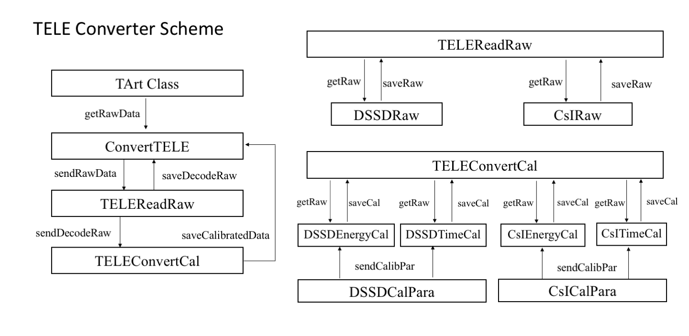
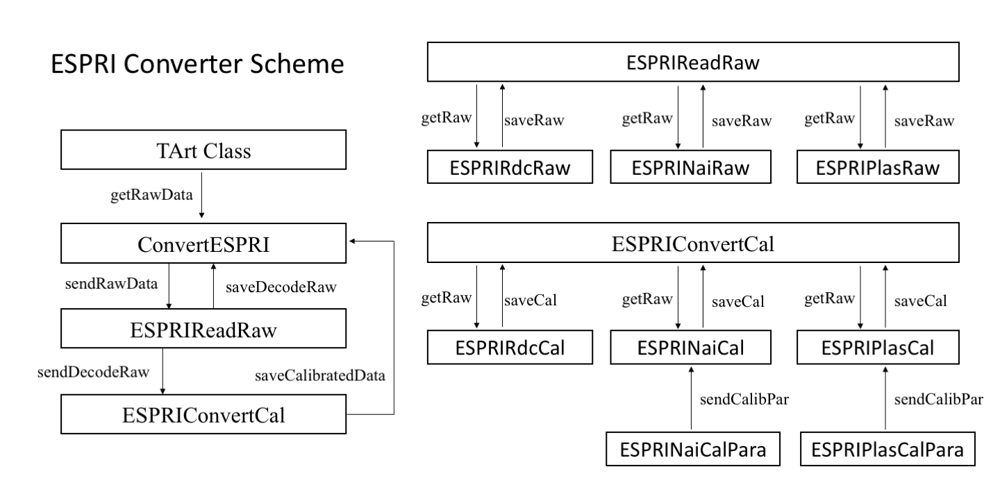

<!-- START doctoc generated TOC please keep comment here to allow auto update -->
<!-- DONT EDIT THIS SECTION, INSTEAD RE-RUN doctoc TO UPDATE -->

- [Converter](#converter)
  - [TELE](#tele)
    - [config](#config)
    - [Scheme](#scheme)
    - [Branches](#branches)
      - [`DSSDRaw`](#dssdraw)
      - [`CsIRaw`](#csiraw)
      - [`DSSDEnergyCal`](#dssdenergycal)
      - [`DSSDTimeCal`](#dssdtimecal)
      - [`CsIEnergyCal`](#csienergycal)
      - [`CsITimeCal`](#csitimecal)
  - [ESPRI](#espri)
    - [config](#config-1)
    - [Scheme](#scheme-1)
    - [Branches](#branches-1)
      - [`ESPRIRdcRaw` in vector](#esprirdcraw-in-vector)
      - [`ESPRINaiRaw`](#esprinairaw)
      - [`ESPRIPlasRaw`](#espriplasraw)
      - [`ESPRIRdcCal`](#esprirdccal)
      - [`ESPRINaiCal`](#esprinaical)
      - [`ESPRIPlasCal`](#espriplascal)
- [Merger](#merger)
- [Analysis](#analysis)

<!-- END doctoc generated TOC please keep comment here to allow auto update -->

# Converter
## DC
### config
### Scheme
- DCReadRaw: reading layer,wire,tdc
- DCConvertCal: converting tdc into position,with exact layerPosition and wirePosition in database
- DCTracking: put it into Merger level, you can make coincidence with other DC, Determine Tracks with BDC1 and BDC2
### Branches
## TELE
### config
- configConvertTELE.prm:
- - db,input,output
- - configed while loading `ConvertTELE` class
- - config calibration Parameters txt path
### Scheme

### Branches
#### `DSSDRaw` 
- [ ] dssdEnergyRaw[4][32]
- [ ] dssdTimeRaw[4][32]
- [ ] RefTime1 
- [ ] RefTime2 
- Silicon: 0 = LF; 1 = LB; 2 = RF; 3 = RB;
- RefTime corresponding to 2 TDC moudle
#### `CsIRaw` 
- [ ] csiEnergyRaw[7];
- [ ] csiTimeRaw[7];
- CsI: 0 = LL; 1 = LRT; 2 = LRB; 3 = RLT; 4 = RLB; 5 =RRT; 6 = RRB;
- [ ] Check this order later
#### `DSSDEnergyCal` 
- [ ] dssdEnergyCal[4][32];
#### `DSSDTimeCal` 
- [ ] dssdTimeCal[4][32];
#### `CsIEnergyCal` 
- [ ] csiEnergyCal[7];
#### `CsITimeCal` 
- [ ] csiTimeCal[7];

## ESPRI
### config
- configConvertESPRI.prm:
- -  db,input,output
- - configed while loading `ConvertESPRI` class
- configCalibESPRI.prm: calibration parameter in txt
- - Because of magnetic field effect, PMT gain changed based on each setting(1PMT Gain changed during Be14 Beam setting)
- - configCalibESPRI_Be10.prm,configCalibESPRI_Be12.prm,configCalibESPRI_Be14.prm,configCalibESPRI_Be14_2.prm
- - configed while in `main()` function
### Scheme

### Branches
#### `ESPRIRdcRaw` in vector
-[ ] rdcTDC
-[ ] rdcPlaneID
-[ ] rdcPlaneNHit
-[ ] rdcWireID
-[ ] plasTimeRef
- (TDC,planeId,wireId) packs give Raw Data
- `PlaneNHit` gives how many wire fired in each plane
- `plasTimeRef` sent to ESPRIPlasRaw Class
#### `ESPRINaiRaw`
-[ ] naiQRaw[4][7]
-[ ] naiMult[4]
- 0:LL, 1:LR, 2:RL,3:RR
- 7 Bars on each side
- storing in array makes no need to name different detectors
#### `ESPRIPlasRaw`
-[ ] plasQRaw[4]
-[ ] plasTRaw[4]
-[ ] plasTimeRef
#### `ESPRIRdcCal`
- [ ] rdcChi2[2]: Trajectory chi2          
- [ ] rdcDL[2][7]:drift length              
- [ ] rdcTch[2][7]:raw TDC channel               
- [ ] rdcRes[2][7]:fitting residue = y - y(fit)              
- [ ] rdcX[2]              
- [ ] rdcY[2]              
- [ ] rdcA[2]               
- [ ] rdcB[2]              
- [ ] rdcMult: 0 No RDC, 1 RDC, 2 RDC fired
- (X,Y,A,B) for DC output
#### `ESPRINaiCal`
- [ ] naiQPed[4][7]
- [ ] naiBarQCal[2][7]
- [ ] naiQ[2]
- [ ] naiQId[2]

|Branch|Meaning|
|--- | --- |
|naiQPed[4][7]|naiQRaw-Ped|
|naiBarQCal[2][7]|`BarQCal = p1*BarQPed+ p2+BarQPed^2 + p3*BarQPed^3` calibratedQ for each bar|
|naiQ[2]|selection BarQCal for each ESPRI|
|naiQId[2]|BarId for BarQCal selection| 
#### `ESPRIPlasCal`
- [ ] plasQPed[4]
- [ ] plasTCal[4]
- [ ] plasQ[2]
- [ ] plasT[2]

|Branch|Meaning|
|--- | --- |
|plasQPed[4] |`QPed = QRaw - Pedestal`|
|plasTCal[4] |NAN|
|plasQ[2]    |`plasQ = sqrt(QUPed*QDPed)/(A+B*sqrt(QUPed*QDPed))`|
|plasT[2]    |NAN|

# Merger

# Analysis
